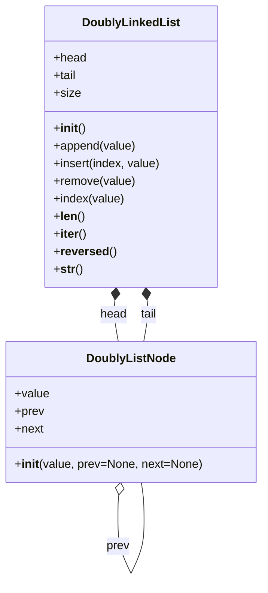

# Задание №3. Вариант 13. Двусвязный список

## Задание

Основная цель варианта — изучить двусвязный список как структуру данных и понять, как он устроен. На защите будут вопросы о самой структуре, её операциях, эффективности и типичном использовании.

В файле `doubly_linked_list.py` реализовать методы класса `DoublyLinkedList`:

- `append` — добавить элемент в конец;
- `insert` — вставить элемент по индексу;
- `remove` — удалить первое вхождение значения;
- `index` — вернуть индекс первого вхождения;
- `__iter__` — обойти значения от головы к хвосту;
- `__reversed__` — обойти значения от хвоста к голове.

Класс узла `DoublyListNode` уже дан в `doubly_list_node.py`. Пример использования — в `main.py`.

**В этом задании** индексы считаются с нуля. Для `insert` допустимы индексы $0 \le \mathrm{index} \le n$, где $n$ — текущая длина: `index = n` означает вставку в конец. Индекс вне этого диапазона, в том числе отрицательный, даёт `IndexError`. Метод `remove` удаляет только первое вхождение и при отсутствии значения даёт `ValueError`. Метод `index` при отсутствии значения возвращает `None`, а не исключение. Длина — поле `size`: его нужно обновлять при добавлении и удалении. Список хранит ссылки `head` на первый узел и `tail` на последний; у пустого списка обе равны `None`. Строковое представление: `[elem1 <-> elem2 <-> elem3]`; пустой список — `[]`.

В файле `test.py` приведены примеры. Команда расширяет набор тестов, чтобы убедиться в корректности своего решения. При проверке учитываются и тесты команды, и дополнительные проверки преподавателя, которые в репозиторий не публикуются.

## Выполнение

1. Разработку вести в отдельной ветке, созданной на основе данной. В названии ветки префикс `main` заменить на название команды.
2. Корректность реализации проверить запуском модульных тестов в файле `test.py`.
3. После установки зависимостей проекта:
   - проверка синтаксиса и оформления: `ruff check .`
   - форматирование: `ruff format .`
4. Результат выполнения задания — Pull request: в **base** — ветку с заданием, из **compare** — ветки команды с решением. Не направлять запрос в `main`.
5. Программный код пишут и правят только участники команды. **Генеративные модели и средства автодополнения кода** использовать для написания и редактирования программного кода нельзя. На защите нужно объяснить код и идеи, заложенные в его реализацию, а также ответить на вопросы по теме задания и материалам лекции.

Порядок установки ПО, работы с Git и разбор ошибок CI описаны в репозитории **docs**. Зелёные Checks на GitHub не означают, что решение принято.

## По теме

**Двусвязный список** — линейная структура из узлов. Каждый узел хранит значение, ссылку на следующий узел и ссылку на предыдущий. В отличие от массива, узлы не обязаны лежать в памяти подряд. В отличие от односвязного списка, от узла можно идти в обе стороны.

Двусвязный список в этом задании начинается с `head` и заканчивается `tail`: это первый и последний узлы или `None`, если список пуст. Доступ к $i$-му элементу от головы требует пройти $i$ ссылок; доступ к элементу у хвоста — пройти от `tail`.

