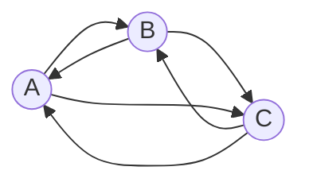

# Задание №5. Вариант 3. Маршруты в треугольнике и биномиальный коэффициент

## Задание

В файле `main.py` реализовать функции:

- `get_triangle_path_count` — вычислить число замкнутых маршрутов заданной длины, которые начинаются и оканчиваются в вершине $A$ треугольника $ABC$;
- `binomial_coefficient_iter` — вычислить биномиальный коэффициент $C_n^k$ итеративно;
- `binomial_coefficient_rec` — вычислить $C_n^k$ рекурсивно.

Подсчёт маршрутов нужно реализовать **тремя функциями со взаимной рекурсией**.

Обе функции биномиального коэффициента принимают только $n$ и $k$ и проверяют вход одинаково. Считать по соотношению

$$
C_n^k = \frac{n}{k}\, C_{n-1}^{k-1}.
$$

Пример использования — в `main.py`.

**В этом задании** длина маршрута — целое число, не меньше $1$. Параметры $n$ и $k$ — целые неотрицательные, $n\ge k$. `bool` не считается целым.

В файле `test.py` приведены примеры. Команда расширяет набор тестов, чтобы убедиться в корректности своего решения. При проверке учитываются и тесты команды, и дополнительные проверки преподавателя, которые в репозиторий не публикуются.

## Выполнение

1. Разработку вести в отдельной ветке, созданной на основе данной. В названии ветки префикс `main` заменить на название команды.
2. Корректность реализации проверить запуском модульных тестов в файле `test.py`.
3. После установки зависимостей проекта:
   - проверка синтаксиса и оформления: `ruff check .`
   - форматирование: `ruff format .`
4. Результат выполнения задания — Pull request: в **base** — ветку с заданием, из **compare** — ветки команды с решением. Не направлять запрос в `main`.
5. Программный код пишут и правят только участники команды. **Генеративные модели и средства автодополнения кода** использовать для написания и редактирования программного кода нельзя. На защите нужно объяснить код и идеи, заложенные в его реализацию, а также ответить на вопросы по теме задания и материалам лекции.

## По теме

**Взаимная рекурсия** — взаимодействие двух или более процедур, при котором они решают общую задачу, рекурсивно вызывая друг друга. Такой приём называют также косвенной рекурсией.

Путешественник перемещается между тремя городами $A$, $B$ и $C$. Каждое ребро двустороннее, петель нет. За день он переходит в соседний город. Требуется число различных замкнутых маршрутов длины $n$, начинающихся и заканчивающихся в $A$.

| $n$ | Маршруты из $A$ в $A$ | Число |
|---|---|---|
| $1$ | нет | $0$ |
| $2$ | $ABA$, $ACA$ | $2$ |
| $3$ | $ABCA$, $ACBA$ | $2$ |
| $4$ | $ABABA$, $ACACA$, $ABACA$, $ACABA$, $ABCBA$, $ACBCA$ | $6$ |

- $a_n$ — число маршрутов длины $n$, которые начинаются и оканчиваются в $A$;
- $b_n$ — число маршрутов длины $n$, которые начинаются в $A$ и оканчиваются в $B$;
- $c_n$ — число маршрутов длины $n$, которые начинаются в $A$ и оканчиваются в $C$.

Ищем $a_n$. Начальные значения:

$$
a_1 = 0,\quad b_1 = 1,\quad c_1 = 1,
$$

$$
a_2 = 2,\quad b_2 = 1,\quad c_2 = 1.
$$

Последний шаг маршрута приходит из соседней вершины. По комбинаторному принципу сложения

$$
\begin{cases}
a_n = b_{n-1} + c_{n-1}, \\
b_n = a_{n-1} + c_{n-1}, \\
c_n = a_{n-1} + b_{n-1}.
\end{cases}
$$

**Биномиальный коэффициент** $C_n^k$ — число сочетаний из $n$ по $k$. В этом задании он задаётся соотношением

$$
C_n^k = \frac{n}{k}\, C_{n-1}^{k-1}
$$

и базой $C_n^0 = 1$ (в том числе $C_0^0 = 1$). Соотношение применяют при $1\le k\le n$.
