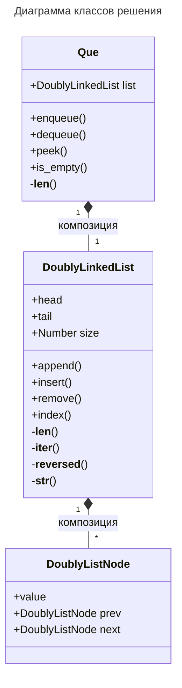

```mermaid
---
title: Диаграмма классов решения
---
classDiagram
	DoublyLinkedList "1" *-- "*" DoublyListNode : композиция
    Que "1" *-- "1" DoublyLinkedList : композиция
    
    class DoublyLinkedList{
	    +head
	    +tail
	    +Number size
	    +append()
	    +insert()
	    +remove()
	    +index()
	    -__len__()
	    -__iter__()
	    -__reversed__()
	    -__str__()
    }
    
    class DoublyListNode{
        +value
        +DoublyListNode prev
        +DoublyListNode next
    }
    class Que{
       +DoublyLinkedList list
       +enqueue()
       +dequeue()
       +peek()
       +is_empty()
       -__len__()
    } 

```

