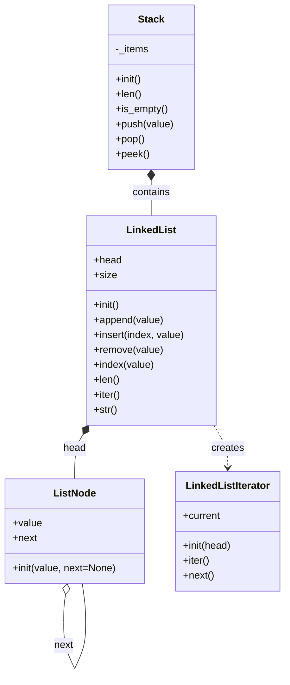

```mermaid
classDiagram
    class Stack {
        -_items
        +init()
        +len()
        +is_empty()
        +push(value)
        +pop()
        +peek()
    }

    class LinkedList {
        +head
        +size
        +init()
        +append(value)
        +insert(index, value)
        +remove(value)
        +index(value)
        +len()
        +iter()
        +str()
    }

    class ListNode {
        +value
        +next
        +init(value, next=None)
    }

    class LinkedListIterator {
        +current
        +init(head)
        +iter()
        +next()
    }

    Stack *-- LinkedList : contains
    LinkedList *-- ListNode : head
    ListNode o-- ListNode : next
    LinkedList ..> LinkedListIterator : creates
```
