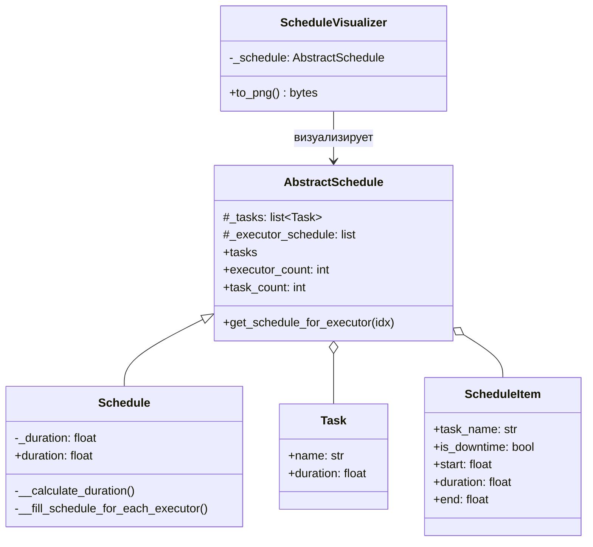

```mermaid
classDiagram
    class Task {
        +name: str
        +duration: float
    }

    class ScheduleItem {
        +task_name: str
        +is_downtime: bool
        +start: float
        +duration: float
        +end: float
    }

    class AbstractSchedule {
        #_tasks: list~Task~
        #_executor_schedule: list
        +tasks
        +executor_count: int
        +task_count: int
        +get_schedule_for_executor(idx)
    }

    class Schedule {
        -_duration: float
        +duration: float
        -__calculate_duration()
        -__fill_schedule_for_each_executor()
    }

    class ScheduleVisualizer {
        -_schedule: AbstractSchedule
        +to_png() bytes
    }

    AbstractSchedule <|-- Schedule
    AbstractSchedule o-- Task
    AbstractSchedule o-- ScheduleItem
    ScheduleVisualizer --> AbstractSchedule : визуализирует
```